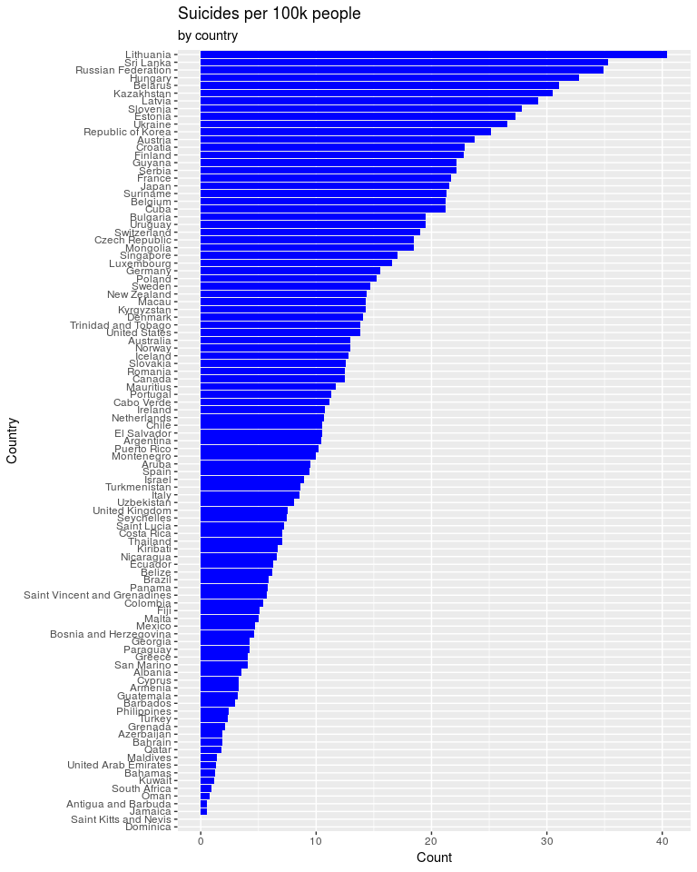
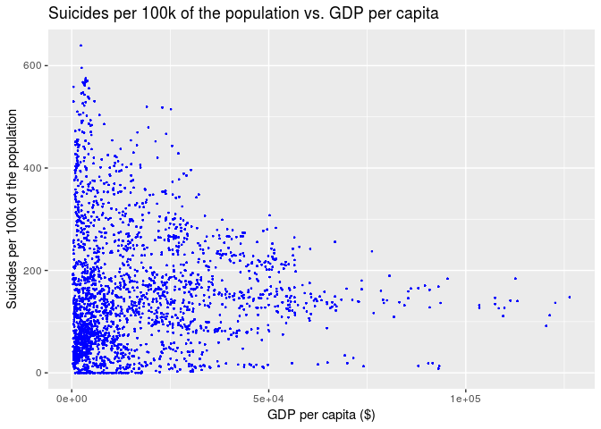

Suicide Data Analysis Project
================
Stats Stars
04/29/19

Your project goes here\! Before you submit, make sure your chunks are
turned off with `echo = FALSE`.

You can add sections as you see fit. Make sure you have a section called
Introduction at the beginning and a section called Conclusion at the
end. The rest is up to you\!

### Introduction

### Load Data and Libraries

### Suicides and Location

<!-- -->

    ## # A tibble: 101 x 2
    ##    country                n
    ##    <chr>              <dbl>
    ##  1 Lithuania           40.4
    ##  2 Sri Lanka           35.3
    ##  3 Russian Federation  34.9
    ##  4 Hungary             32.8
    ##  5 Belarus             31.1
    ##  6 Kazakhstan          30.5
    ##  7 Latvia              29.3
    ##  8 Slovenia            27.8
    ##  9 Estonia             27.3
    ## 10 Ukraine             26.6
    ## # … with 91 more rows

### Suicides and Economic Situation

<!-- -->

    ## # A tibble: 2 x 5
    ##   term                    estimate std.error statistic p.value
    ##   <chr>                      <dbl>     <dbl>     <dbl>   <dbl>
    ## 1 (Intercept)          153.        0.940       163.      0    
    ## 2 `gdp_per_capita ($)`   0.0000183 0.0000371     0.493   0.622

    ## [1] 8.740802e-06

Equation for the linear model is: (Suicides per 100k of the
population-hat) = (1.533301e+02) + (1.830459e-05\*GDP per capita($))
R-squared value is: 8.740802e-06

### Suicides and Generation/Age

### Suicides and Year

Group number of suicides together by year to find number of suicides for
each year:

Create visualization to represent the number of suicides for each year:

<!-- -->

### Suicides and Sex

Group number of suicides together by sex to find number of suicides for
each sex:

Create visualization to represent the number of suicides for each year:

<!-- -->

Compare number of suicides for each sex per year:

    ## # A tibble: 64 x 3
    ## # Groups:   year [?]
    ##     year sex        n
    ##    <dbl> <chr>  <int>
    ##  1  1985 female   288
    ##  2  1985 male     288
    ##  3  1986 female   288
    ##  4  1986 male     288
    ##  5  1987 female   324
    ##  6  1987 male     324
    ##  7  1988 female   294
    ##  8  1988 male     294
    ##  9  1989 female   312
    ## 10  1989 male     312
    ## # … with 54 more rows

<!-- -->

### Linear Modeling

### Conclusion
