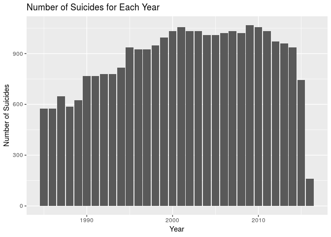
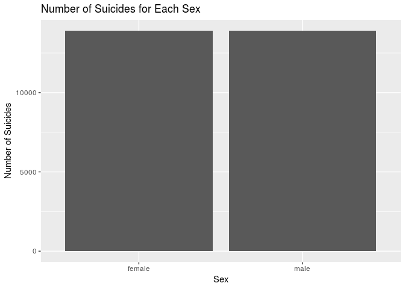
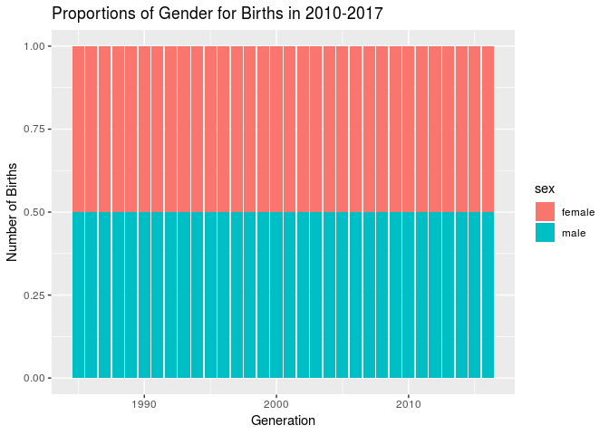

Suicide Data Analysis Project
================
Stats Stars
04/29/19

Your project goes here\! Before you submit, make sure your chunks are
turned off with `echo = FALSE`.

You can add sections as you see fit. Make sure you have a section called
Introduction at the beginning and a section called Conclusion at the
end. The rest is up to you\!

### Introduction

### Load Data and Libraries

### Suicides and Location

### Suicides and Economics and Generation (Age)

    ## # A tibble: 27,820 x 12
    ##    country  year sex   age   suicides_no population `suicides/100k …
    ##    <chr>   <dbl> <chr> <chr>       <dbl>      <dbl>            <dbl>
    ##  1 Albania  1987 male  15-2…          21     312900             6.71
    ##  2 Albania  1987 male  35-5…          16     308000             5.19
    ##  3 Albania  1987 fema… 15-2…          14     289700             4.83
    ##  4 Albania  1987 male  75+ …           1      21800             4.59
    ##  5 Albania  1987 male  25-3…           9     274300             3.28
    ##  6 Albania  1987 fema… 75+ …           1      35600             2.81
    ##  7 Albania  1987 fema… 35-5…           6     278800             2.15
    ##  8 Albania  1987 fema… 25-3…           4     257200             1.56
    ##  9 Albania  1987 male  55-7…           1     137500             0.73
    ## 10 Albania  1987 fema… 5-14…           0     311000             0   
    ## # … with 27,810 more rows, and 5 more variables: `country-year` <chr>,
    ## #   `HDI for year` <dbl>, `gdp_for_year ($)` <dbl>, `gdp_per_capita
    ## #   ($)` <dbl>, generation <chr>

### Suicides and Year

Group number of suicides together by year to find number of suicides for
each year:

Create visualization to represent the number of suicides for each year:

<!-- -->

### Suicides and Sex

Group number of suicides together by sex to find number of suicides for
each sex:

Create visualization to represent the number of suicides for each year:

<!-- -->

Compare number of suicides for each sex per year:

    ## # A tibble: 64 x 3
    ## # Groups:   year [?]
    ##     year sex        n
    ##    <dbl> <chr>  <int>
    ##  1  1985 female   288
    ##  2  1985 male     288
    ##  3  1986 female   288
    ##  4  1986 male     288
    ##  5  1987 female   324
    ##  6  1987 male     324
    ##  7  1988 female   294
    ##  8  1988 male     294
    ##  9  1989 female   312
    ## 10  1989 male     312
    ## # … with 54 more rows

<!-- -->

### Linear Modeling

### Conclusion
