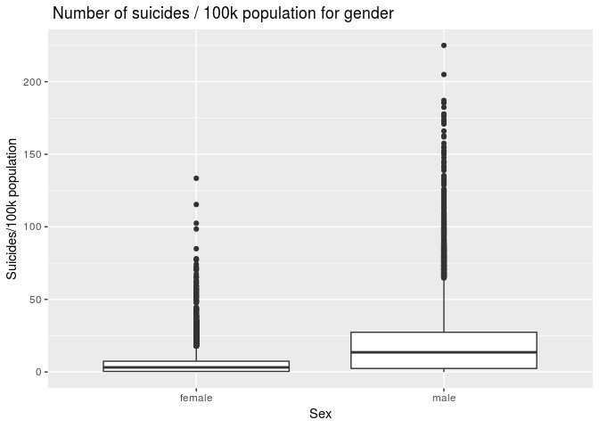
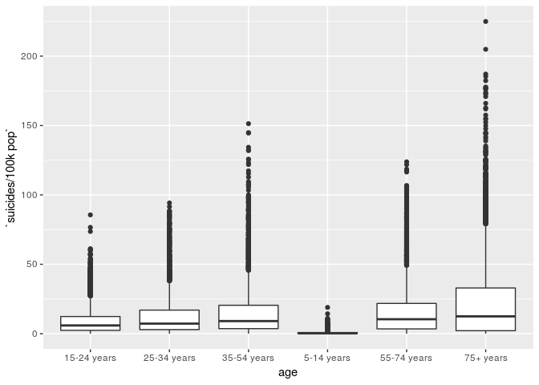

Suicide Data Analysis Project Proposal
================
Stat Stars
March 29th, 2019

### Load Data and Libraries

``` r
library(tidyverse)
suicides <- read_csv("/cloud/project/data/master.csv")
```

## Section 1. Introduction

The introduction should introduce your general research question and
your data (where it came from, how it was collected, what are the cases,
what are the variables, etc.).

This dataset provides statistics for suicides worldwide between 1985 and
2016. It has data that was collected via compilation of data from the UN
Development Program, the World Bank, Kaggle, and the World Health
Organization. The purpose of compiling the data was “to find signals
correlate to increased suicide rates among different cohorts globally,
across the socio-economic spectrum” (Kaggle). Each occurrence provided
represents the country, year, sex, age (in groups), number of suicides,
population, suicide rate for 100 thousand people, country-year, hdi
(human development), gdp for the year (in USD), the gdp per capita (in
USD), and the generation of a single suicide. This will allow us to look
at a single occurrence, but also group based on incomes, gender, year,
country, or some combination of the variables.

Our overarching research question guiding our investigation is:

Do location, year, sex, and economic situation contribute to suicide
rates?

This research question will allow us to see where and when economic
changes, like the crash in 2008 affected the suicide rate, and for how
long. This is an important investigation to conduct because
understanding the relationship between economics and mental health is
important, given that so much of society is attached to and operated
with the purpose of earning more money. Furthermore, it will allow us to
see certain groups- like men or women, high or low socioeconomic status
were affected more or less so than other groups. This will allow us to
understand the impact economic changes has on the metal health and
suicide rates. It will also be interesting to see the progression of
changes in suicide rates and how a person of a certain intersection of
identities is affected differently. We will be able to use linear
modelling to make limited predictions of changes in suicide rates if a
crash were to ocurr. We are purposely leaving the research question
broad, so that we can compare a variety of the statistics and not become
too focused too early on in the investigation.

We acknowledge the pitfalls of the data. For instance, there is not
detailed collection information such as method as it is a compilation of
other data. Furthermore, it is known that suicides sometimes go falsely
reported or unreported at all- for instance, suicides have been
occasionally reported as farming or hunting accidents- so we will be
conscious of this as we conduct the investigation. It has also come to
our attention that not every nation is represented, which will limit our
ability to compare truly worldwide, but we will be able to compare
nation to nation and region to region.

The data can be found here:
<https://www.kaggle.com/russellyates88/suicide-rates-overview-1985-to-2016>

## Section 2. Data analysis plan

We plan to use a variety of variables to see how they impact number of
suicides per 100,000 people of the population in different countries.
Some of the variables we will explore are GDP per capita, gender,
generation, and age. We will also see how trends in suicide rate vary by
country.

Because our research question asks if location, year, sex, and economic
situation contribute to suicide rates, we are asking about the
relationship between variables and whether or not our predictors have a
correlation with our outcome. The predictor variables in this data set
are GDP per capita, gender, generation, country, and age, and our
outcome variable are the no of suicides/100k population. We are
comparing relationships between GDP per capita and number of
suicides/100k population , gender and number of suicides, generation and
number of suicides, country and number of suicides, and age and number
of suicides/100k population.

Exploratory Data Analysis:

I first tried to find average number of suicides by country. However,
the first result showed many numbers very very close to 1. This seems to
be because the data is very specific. Not only does every country and
year have its own number of suicides but so does every every and age
group. This means that there are a lot of entries of 0 suicides in
specific age group that cause the average to get very close to 0. To do
broader analysis by year, we’re going to need to make new entries that
have the total number of suicides in a given country in a year.

In order to look more into relationships betweeen specific variables, we
may need to use the count() function to determine the number of
suicides/100k population for a specific variable, instead of looking at
12 variables at once. I’ve done this in the code below if we’re
interested in exploring more about relationships between location and
number of suicides/100k population.

Count number of suicides in each country:

``` r
suicides %>%
  count(`suicides/100k pop`, country) %>%
  arrange(desc(n))
```

    ## # A tibble: 21,261 x 3
    ##    `suicides/100k pop` country                          n
    ##                  <dbl> <chr>                        <int>
    ##  1                   0 Antigua and Barbuda            314
    ##  2                   0 Grenada                        280
    ##  3                   0 Saint Vincent and Grenadines   228
    ##  4                   0 Barbados                       220
    ##  5                   0 Bahamas                        211
    ##  6                   0 Saint Lucia                    209
    ##  7                   0 Belize                         197
    ##  8                   0 Malta                          182
    ##  9                   0 Seychelles                     156
    ## 10                   0 Bahrain                        146
    ## # … with 21,251 more rows

Antigua and Barbuda have the highest number of suicides/100k population
from 1985 to 2016.

When I did some exploratory analysis comparing sex and number of
suicides, I made this boxplot. Clearly, males have many more large
outliers than females do and also show a higher average number of
suicides. This will be an interesting trend to explore and find the
cause of.

Create box plot for gender and number of suicides:

``` r
suicides %>%
  ggplot(aes(x = sex, y = `suicides/100k pop`)) + 
  geom_boxplot() + labs(title = " Number of suicides / 100k population for gender", x = "Sex", y = "Suicides/100k population")
```

<!-- -->

Calculate summary statistics for box plot:

``` r
suicides %>%
  group_by(sex) %>%
  summarise(min = min(`suicides/100k pop`), max = max(`suicides/100k pop`),
            median = median(`suicides/100k pop`),
            q1 = quantile(`suicides/100k pop`, probs = 0.25),
            q3 = quantile(`suicides/100k pop`, probs = 0.75), 
            iqr = q3 - q1)
```

    ## # A tibble: 2 x 7
    ##   sex      min   max median    q1    q3   iqr
    ##   <chr>  <dbl> <dbl>  <dbl> <dbl> <dbl> <dbl>
    ## 1 female     0  133.   3.16  0.41  7.41   7  
    ## 2 male       0  225.  13.6   2.42 27.4   24.9

I also did some data analysis to see if there were differences in
comparing number of suicide rates and age groups. There were clear
differences in suicide rates by age group, with a trend that seemed to
be proportional.

A boxplot was chosen because it depicts the relationship between a
numerical and categorical variable. The graph shows the number of
suicides for each gender. The middle line in the box represents the
median number of suicides/100k population. Males have the highest median
number of suicides/100k population (13.55 suicides/100k population),
while females have the lowest median number of suicides/100k population
(3.16 suicides/100k population). Females have an outlier as far as
133.42 suicides/100k population, and males have an outlier as far as
223.97 suicides/100k popuatlion as shown by the dots in the graph. The
25th percentile is represented by the lower line of the box, while the
75th percentile is represented by the upper line of the box. The IQR is
equal to the difference between the 75th and 25th percentile and is
represented by what is inside the box. Females have the lowest IQR (7
suicides/100k population) and males have the largest IQR (24.94
suicides/100k population). IQR tells us that females have the smallest
spread, while males have the largest spread.

Create box plots for age and number of suicides:

``` r
suicides %>%
  ggplot(aes(x = age, y = `suicides/100k pop`)) +
  geom_boxplot()
```

<!-- -->

Calculate summary statistics for box plot:

``` r
suicides %>%
  group_by(age) %>%
  summarise(min = min(`suicides/100k pop`), max = max(`suicides/100k pop`),
            median = median(`suicides/100k pop`),
            q1 = quantile(`suicides/100k pop`, probs = 0.25),
            q3 = quantile(`suicides/100k pop`, probs = 0.75), 
            iqr = q3 - q1)
```

    ## # A tibble: 6 x 7
    ##   age           min   max median    q1    q3   iqr
    ##   <chr>       <dbl> <dbl>  <dbl> <dbl> <dbl> <dbl>
    ## 1 15-24 years     0  85.6   5.92  2.41 12.4   9.95
    ## 2 25-34 years     0  94.2   7.25  2.93 17.0  14.0 
    ## 3 35-54 years     0 151.    9.08  3.65 20.5  16.8 
    ## 4 5-14 years      0  18.9   0.32  0     0.81  0.81
    ## 5 55-74 years     0 124.   10.4   3.45 21.8  18.3 
    ## 6 75+ years       0 225.   12.5   2.15 32.9  30.8

A boxplot was chosen because it depicts the relationship between a
numerical and categorical variable. The graph shows the number of
suicides for each age The middle line in the box represents the median
number of suicides/100k population. People 75+ years old have the
highest median number of suicides/100k population (12.47 suicides/100k
population), while people 5-14 years old have the lowest median number
of suicides/100k population (0.320 suicides/100k population). People
15-24 years old have an outlier as far as 85.59 suicides/100k
population, people 25-34 years with 94.18 suicides/100k population,
people 35-54 years old with 151.33 suicides/100k population, people 5-14
years old with 18.92 suicides/100k population, people 55-74 years old
with 123.83 suicides/100k population, and people 75+ years old with
224.97 suicides/100k population. The 25th percentile is represented by
the lower line of the box, while the 75th percentile is represented by
the upper line of the box. The IQR is equal to the difference between
the 75th and 25th percentile and is represented by what is inside the
box. People 5-14 years old have the lowest IQR (0.81 suicides/100k
population) and people 75+ years old have the largest IQR (30.78
suicides/100k population). IQR tells us that people 5-14 years old have
the smallest spread, while people 75+ years old have the largest spread.

Some of the statistical methods that we could use in answering our
questions could be hypothesis tests, linear regression, and
bootstrapping techniques. We could use these tests to determine the
strength and validity of a relationship. When we do hypothesis tests we
are looking for p-values at or below 0.05 to determine whether there is
no difference between number of suicides/100k population for variables
of one type versus number of suicides/100k population for variables of
another type (if there is a difference between number of suicides/100k
population for females than for males). And when we do linear regression
models we are looking for high r-squared values. Higher r-squared values
indicates that there is higher linear correlation between variables.

## Section 3. Data

Uploaded the data master.csv and save it to the suicides dataframe. Then
glimpse.

``` r
library(tidyverse)
suicides <- read_csv("/cloud/project/data/master.csv")
glimpse(suicides)
```

    ## Observations: 27,820
    ## Variables: 12
    ## $ country              <chr> "Albania", "Albania", "Albania", "Albania",…
    ## $ year                 <dbl> 1987, 1987, 1987, 1987, 1987, 1987, 1987, 1…
    ## $ sex                  <chr> "male", "male", "female", "male", "male", "…
    ## $ age                  <chr> "15-24 years", "35-54 years", "15-24 years"…
    ## $ suicides_no          <dbl> 21, 16, 14, 1, 9, 1, 6, 4, 1, 0, 0, 0, 2, 1…
    ## $ population           <dbl> 312900, 308000, 289700, 21800, 274300, 3560…
    ## $ `suicides/100k pop`  <dbl> 6.71, 5.19, 4.83, 4.59, 3.28, 2.81, 2.15, 1…
    ## $ `country-year`       <chr> "Albania1987", "Albania1987", "Albania1987"…
    ## $ `HDI for year`       <dbl> NA, NA, NA, NA, NA, NA, NA, NA, NA, NA, NA,…
    ## $ `gdp_for_year ($)`   <dbl> 2156624900, 2156624900, 2156624900, 2156624…
    ## $ `gdp_per_capita ($)` <dbl> 796, 796, 796, 796, 796, 796, 796, 796, 796…
    ## $ generation           <chr> "Generation X", "Silent", "Generation X", "…
